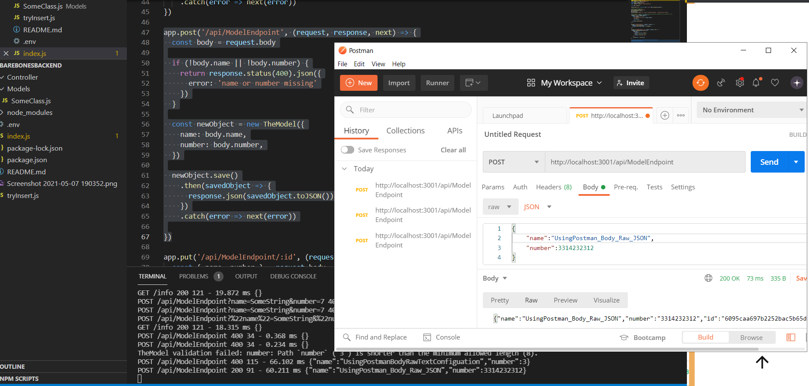
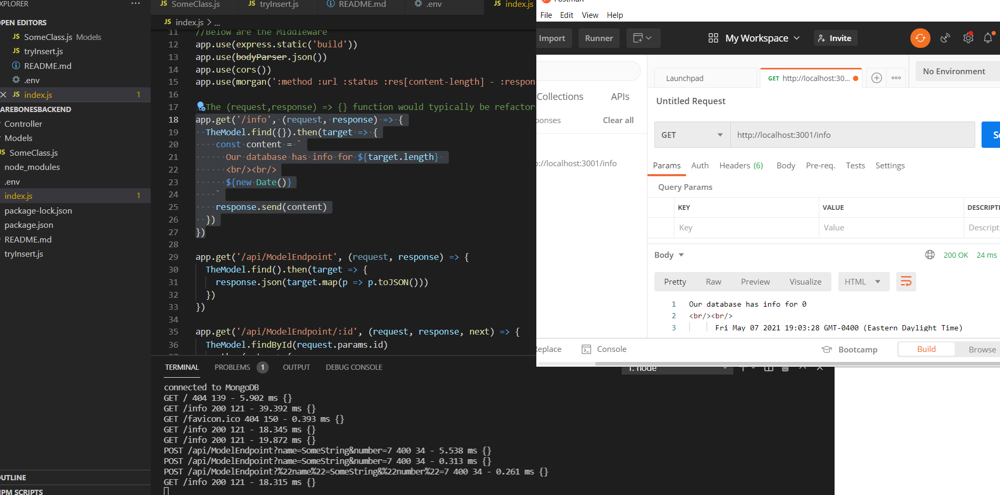
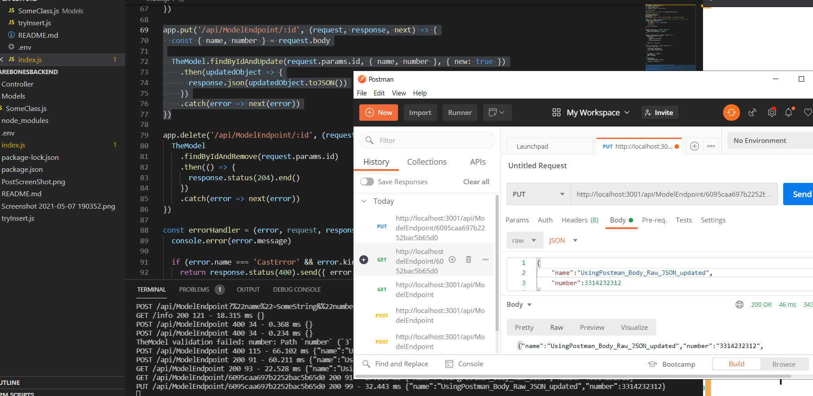

"npm install"  (this installs required packages)  
"node index.js" or "npm start" to run server at localhost.com:3001   

A simple server that includes "index.js" and "Models/SomeClass.js"  
Start the server  
Send a postman request to test the server  
Send a post request by setting the body to raw JSON  

  
  
  
